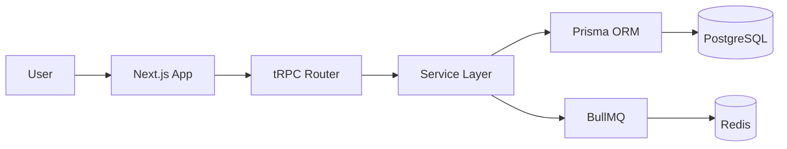

# Claude Code 初学者完整全套教程

> 涵盖从安装到 Agent Teams 的所有核心功能，共 20 个模块。  
> 最后更新：2026年4月 | 适用版本：Claude Code v2.1+

---

## 目录

1. [安装与登录](#1-安装与登录)
2. [第一次使用](#2-第一次使用)
3. [斜杠命令完整速查](#3-斜杠命令完整速查)
4. [键盘快捷键](#4-键盘快捷键)
5. [CLAUDE.md 项目配置文件](#5-claudemd-项目配置文件)
6. [Plan Mode（计划模式）](#6-plan-mode计划模式)
7. [settings.json 权限配置](#7-settingsjson-权限配置)
8. [Hooks 自动化钩子](#8-hooks-自动化钩子)
9. [自定义命令 & Skills](#9-自定义命令--skills)
10. [MCP 服务器集成](#10-mcp-服务器集成)
11. [IDE 集成](#11-ide-集成)
12. [子代理（Subagents）](#12-子代理subagents)
13. [Agent Teams（多代理协作）](#13-agent-teams多代理协作)
14. [Git 工作流最佳实践](#14-git-工作流最佳实践)
15. [CI/CD 集成](#15-cicd-集成)
16. [提示词工程技巧](#16-提示词工程技巧)
17. [上下文管理](#17-上下文管理)
18. [成本控制与 Token 优化](#18-成本控制与-token-优化)
19. [实战工作模式](#19-实战工作模式)
20. [故障排查完全手册](#20-故障排查完全手册)

---

## 1. 安装与登录

**系统要求：** macOS / Linux / Windows 11，需要 Claude Pro（$20/月）或以上套餐。

### 安装方式

#### 官方安装器（推荐）

```bash
# macOS / Linux / WSL2
curl -fsSL https://claude.ai/install.sh | sh

# Windows PowerShell（必须用 PS，不能用 Git Bash）
irm https://claude.ai/install.ps1 | iex

# 验证安装
claude --version
```

> 官方安装器自动后台更新，无需手动升级，推荐所有平台首选。

#### Homebrew（macOS）

```bash
brew install --cask claude-code          # 稳定版（滞后约一周）
brew install --cask claude-code@latest   # 最新版
brew upgrade claude-code                 # 手动更新（不自动更新）
```

#### WinGet（Windows）

```bash
winget install Anthropic.ClaudeCode    # 安装
winget upgrade Anthropic.ClaudeCode    # 手动更新
```

> 注意：必须在 PowerShell 里操作（`PS C:\` 前缀），不要用 Git Bash。

#### npm

```bash
npm install -g @anthropic-ai/claude-code  # 需要 Node.js 18+
```

> 官方文档已不再主推此方式，优先使用官方安装器。

#### Linux 包管理器

```bash
sudo apt install claude-code   # Debian / Ubuntu
sudo dnf install claude-code   # Fedora / RHEL
sudo apk add claude-code       # Alpine
```

### 首次登录

```bash
cd your-project    # 必须先进入项目目录
claude             # 启动，首次弹出浏览器完成登录
# 选择 "Log in with subscription account"（已有 Pro 订阅）
# 凭证保存在 ~/.claude/，之后不需要重复登录
```

### 套餐对比

| 套餐 | 价格 | 适合 | 说明 |
|------|------|------|------|
| Pro | $20/月 | 初学者、轻度使用 | 已包含 Claude Code，有使用限制 |
| Max | $100/月 | 全职开发者 | 高用量、含 Agent Teams 访问 |
| Max 20x | $200/月 | 超重度/团队 | 最高用量上限 |
| Team | $150/用户/月 | 开发团队 | 集中账单、团队管理 |
| API 按量 | 按 token | 企业/Bedrock | 无限制，适合 CI/CD 集成 |

> **提示：** 已有 Claude.ai Pro 订阅？直接安装 Claude Code 即可，不需要额外付费。

---

## 2. 第一次使用

### 四种输入模式

| 前缀 | 作用 | 示例 |
|------|------|------|
| `/` 斜杠 | 调用内置命令（输入后继续打字可过滤） | `/clear`、`/model` |
| `!` 感叹号 | 执行 shell 命令，输出传给 Claude 分析 | `! git status`、`! npm test` |
| `@` 艾特 | 引用文件、目录或 URL 加入上下文 | `@src/api.ts`、`@README.md` |
| 普通文字 | 自然语言描述任务 | `帮我重构这个函数` |

### @引用完整语法

```
@README.md                     # 引用单个文件
@src/components/               # 引用整个目录（Claude 读取所有文件）
@src/api.ts#L10-50             # 引用特定行范围（精准定位）
@https://docs.example.com      # 抓取网页内容（只读，实时抓取）
@terminal:my-terminal          # VS Code 终端输出（调试时用）
@browser                       # 浏览器当前页面（需 Claude in Chrome 扩展）
```

### 黄金四步工作法（Explore → Plan → Code → Verify）

| 阶段 | 说明 | 关键点 |
|------|------|--------|
| **Explore** | 先探索，不动手 | 读文件、用子代理验证，**禁止写代码** |
| **Plan** | 制定详细计划 | 用 `think hard` 提高推理深度，等你确认后再执行 |
| **Code** | 分阶段实现 | 每阶段有验收测试，不一次性执行所有步骤 |
| **Verify** | 独立验证结果 | 跑真实测试，**不接受 Claude 的"完成"声明** |

> **数据：** Anthropic 内部研究表明，未经结构化指导的任务成功率约 33%。使用 Explore→Plan→Code→Verify 后可达 70%+。

---

## 3. 斜杠命令完整速查

在会话中输入 `/` 查看全部列表，继续打字可过滤。

### 会话与上下文管理

| 命令 | 说明 |
|------|------|
| `/clear` | 清空对话历史（文件修改保留），切换新任务时用 |
| `/compact` | 压缩历史为摘要，保留上下文，超 60% 时主动用 |
| `/compact 保留XXX` | 压缩时指定需要保留的重点内容 |
| `/context` | 查看 token 使用分布，分析 MCP 占用情况 |
| `/diff` | 本次会话所有文件改动汇总 |
| `/undo` | 撤销上一次文件修改 |
| `/resume` | 交互式选择历史会话继续 |
| `/btw 问题` | 长任务执行中插入提问，不打断任务流程 |

### 模型与推理

| 命令 | 说明 |
|------|------|
| `/model` | 交互式选择模型 |
| `/model claude-sonnet-4-6` | 直接切换到 Sonnet（日常任务，快速省成本） |
| `/model opusplan` | Opus 推理 + Sonnet 执行，复杂任务最佳组合 |
| `/effort` | 打开滑块调整推理深度（low / medium / high / xhigh） |
| `/effort high` | 直接设为 high。xhigh 仅 Opus 4.7 支持 |

### 配置与工具

| 命令 | 说明 |
|------|------|
| `/cost` | 当前会话 token 消耗统计 |
| `/memory` | 管理自动记忆（查看 / 编辑 / 清除） |
| `/permissions` | 查看和管理当前工具权限 |
| `/hooks` | 交互式菜单配置 Hooks（比手写 JSON 友好） |
| `/config` | 查看和修改会话配置 |
| `/theme` | 切换语法高亮主题（含自动跟随终端深浅模式） |
| `/sandbox` | 开启沙箱：隔离 bash，阻止未授权网络访问 |
| `/doctor` | 诊断配置和环境问题 |
| `/debug` | 开关调试日志（mid-session 排查用） |
| `/release-notes` | 查看最新版本更新内容 |
| `/vim` | 开启 vim 键位绑定（完整 Normal/Insert 模式） |
| `/terminal-setup` | 修复 Shift+Enter 等终端快捷键 |
| `/keybindings` | 编辑 `~/.claude/keybindings.json` 自定义快捷键 |

### 代码审查与集成

| 命令 | 说明 |
|------|------|
| `/simplify` | 三并行代理审查（架构/重复/性能），替代废弃的 `/review` |
| `/install-github-app` | 安装 GitHub App，Claude 自动审查 PR |
| `/schedule` | 创建定时任务（云端执行，机器关机也能跑） |
| `/loop 30m /cmd` | 会话内定时循环执行命令 |
| `/batch` | 多个独立子任务并行处理（自动 worktree 隔离） |
| `/mcp` | 查看和管理 MCP 服务器 |
| `/ide` | 连接外部终端到 VS Code |

### CLI 启动参数速查

```bash
claude -p "任务描述"                          # 非交互模式（CI/脚本）
claude --model claude-sonnet-4-6             # 指定模型
claude --max-turns 15                        # 限制最大回合数
claude --resume                              # 选择历史会话继续
claude --continue                            # 继续最近一次会话
claude --worktree feature-auth               # 在独立 worktree 中启动
claude --worktree                            # 自动生成 worktree 名称
claude --add-dir /path/to/other-project      # 加载额外目录上下文
claude --dangerously-skip-permissions        # 跳过所有确认（CI 用）
claude --agent code-reviewer                 # 以指定子代理身份启动
CLAUDE_CODE_EXPERIMENTAL_AGENT_TEAMS=1 claude  # 开启 Agent Teams
```

---

## 4. 键盘快捷键

### 核心快捷键

| 快捷键 | 功能 |
|--------|------|
| `Shift+Tab` | 循环切换：普通 → 自动接受 → Plan Mode |
| `Esc` | 停止 Claude 当前操作（不是退出会话） |
| `Esc Esc` | 显示历史消息列表，可快速跳转 |
| `↑ 方向键` | 浏览历史对话（可跨会话） |
| `Tab` | 自动补全命令名和文件路径 |
| `Ctrl+G` | 用 `$EDITOR` 编辑长提示词，保存后自动发送 |
| `Alt+T` | 切换扩展思维（深度推理） |
| `Alt+P` | 切换模型（需配置 Option 为 Meta） |
| `Alt+B` | 开始 `/btw` 插入提问模式 |
| `Alt+F` | Fast Mode（2.5x 速度，6x 成本） |
| `Ctrl+O` | 切换详细/简洁输出模式 |
| `Ctrl+V` | 粘贴图片（macOS 也是 Ctrl+V，不是 Cmd+V） |

### 输入框编辑快捷键

| 快捷键 | 功能 |
|--------|------|
| `Ctrl+A` | 光标移到行首 |
| `Ctrl+E` | 光标移到行尾 |
| `Alt+←/→` | 按单词跳转光标 |
| `Ctrl+K` | 删除光标到行尾 |
| `Ctrl+U` | 删除整行 |
| `Ctrl+W` | 删除前一个单词 |

> **macOS 必看：** Alt 快捷键需要在终端把 Option 键设置为 `Esc+`。  
> iTerm2 路径：Settings → Profiles → Keys → Left/Right Option Key → Esc+  
> 不设置则 Alt 快捷键全部无效。

> **停止用 `Esc`，不是 `Ctrl+C`。** Ctrl+C 直接退出整个会话，上下文全丢。

### 文件操作技巧

| 操作 | 方法 |
|------|------|
| 拖入文件引用 | 按住 `Shift` 再拖（普通拖文件会开新 tab） |
| 粘贴图片 | `Ctrl+V`（macOS 也是，不是 Cmd+V） |
| 换行输入 | 先 `/terminal-setup` 修复，之后可用 `Shift+Enter` |
| 开启 Vim 模式 | `/vim`，支持完整 Normal/Insert 模式、文本对象 |
| 编写长提示词 | `Ctrl+G` 打开系统编辑器，保存后自动发送 |

---

## 5. CLAUDE.md 项目配置文件

Claude 每次启动时自动读取，是保持 AI 行为一致性的核心机制。

### 文件层级（优先级从高到低）

| 文件路径 | 作用 | 是否提交 Git |
|----------|------|-------------|
| `~/.claude/CLAUDE.md` | 全局个人，所有项目通用 | 否 |
| `./CLAUDE.md` | 项目共享，团队统一 | **是（推荐）** |
| `./src/CLAUDE.md` | 子目录专用规范 | 视情况 |
| `.claude/rules/` | 模块化规则文件（2026 新特性） | 视情况 |

### 企业级完整模板

```markdown
# 项目概述
这是基于 Next.js 14 + TypeScript 的 SaaS 平台，支持 10 万+用户。

## 技术栈
- 前端：Next.js 14（App Router）、Tailwind CSS v4、shadcn/ui
- 后端：tRPC v11、Prisma v5、NextAuth.js v5
- 数据库：PostgreSQL 16（开发用 Docker Compose）
- 队列：BullMQ + Redis
- 测试：Vitest（单元）+ Playwright（E2E）

## 常用命令
- 开发服务器：`npm run dev`（端口 3000）
- 全部测试：`npm test`
- E2E 测试：`npm run test:e2e`
- 类型检查：`npm run type-check`（提交前必须通过）
- DB 迁移：`npx prisma migrate dev --name=迁移名称`
- 生成类型：`npx prisma generate`
- 启动 Docker：`docker compose up -d`

## 编码规范（强制）
- TypeScript 严格模式，禁用 any
- 组件 PascalCase，函数/文件 camelCase，常量 UPPER_SNAKE_CASE
- API 统一返回 `{ success: boolean, data?: T, error?: string }`
- 所有 DB 写操作必须在事务内
- 错误必须用 logger 记录，不能用 console.log
- Commit 格式：Conventional Commits（feat/fix/chore/docs）

## 项目结构
- `src/app/` — Next.js App Router 页面和 API
- `src/components/` — 共享组件（先查是否已有再创建）
- `src/server/routers/` — tRPC 路由（不放业务逻辑）
- `src/server/services/` — 业务逻辑
- `src/lib/` — 第三方集成和工具函数

## 禁止修改的文件
- `src/lib/auth.ts` — 认证核心，任何改动需先讨论
- `.env.production` — 只读
- `prisma/migrations/` — 已执行的迁移文件，不要修改

## 架构决策（ADR）
- 用 tRPC 而非 REST：类型端到端安全
- 用 BullMQ 处理异步任务：解耦、可重试
- Server Components 优先，仅在需要交互时用 Client Components

## CI/CD 环境注意事项
- 在 CI 中不修改配置文件，不直接提交到 main
- 创建分支格式：claude/issue-{号}/brief-desc
- PR 评论使用 GitHub Flavored Markdown
```

### Mermaid 架构图注入（强烈推荐）

在 CLAUDE.md 中加入架构图，比文字描述更清晰：

````markdown

````

### 自动生成 CLAUDE.md

```bash
# 方式 1：使用 /init 命令
/init

# 方式 2：提示词方式
分析这个项目，为我生成 CLAUDE.md，包含：
项目简介、完整技术栈、所有常用命令、编码规范、
目录结构说明、禁止修改的文件、架构决策记录。
```

### .claudeignore 排除文件

```gitignore
# .claudeignore — 类似 .gitignore，减少无关文件扫描
node_modules/
.next/
dist/
build/
coverage/
*.log
.env*
*.min.js
*.map
```

---

## 6. Plan Mode（计划模式）

先思考再执行 — 复杂任务成功率从 33% 提升到 70%+。

### 开启方式

| 方式 | 操作 |
|------|------|
| 键盘 | 按 `Shift+Tab` 两次循环切换到 Plan Mode |
| 提示词 | `先制定详细计划，不要写代码，等我确认后再执行` |
| 模型 | `/model opusplan`（Opus 推理 + Sonnet 执行） |
| VS Code | 点击提示框底部的模式指示器 |

### Think 关键词提升推理深度

| 关键词 | 计算量 | 适合场景 |
|--------|--------|----------|
| `think` | 基础 | 普通分析、代码解释 |
| `think hard` | 中等 | 多文件重构、架构设计 |
| `think harder` | 高 | 复杂算法、难以复现的 bug |
| `ultrathink` | 最高 | 安全审计、性能瓶颈根因分析 |

### Plan Mode 完整对话示例

```
# 进入 Plan Mode 后输入：
think hard，我要为博客系统添加评论功能，要求：
- 支持嵌套回复（最多 3 层）
- 登录后才能评论
- 管理员可删除
- 评论数量实时更新

请先给我详细技术方案，包含：
1. 数据库表设计（字段、索引、关系）
2. 需要创建的 tRPC 路由列表
3. 涉及文件变更（按执行顺序）
4. 每个阶段的验收标准

# Claude 输出计划后，确认并说：
按计划从数据库设计开始，完成后等我验收再继续。
```

### 模型选择策略

| 模型 | 速度 | 成本 | 最适合 |
|------|------|------|--------|
| `claude-haiku-4-5` | 最快 | 最低 | 探索性子代理、文件搜索 |
| `claude-sonnet-4-6` | 快 | 中 | 日常开发（80% 时间用这个） |
| `claude-opus-4-6` | 慢 | 高 | 架构决策、复杂重构、安全审计 |
| `opusplan` | 中 | 中 | 规划用 Opus，执行用 Sonnet |

---

## 7. settings.json 权限配置

### 配置文件层级（优先级从高到低）

| 文件路径 | 作用 | 提交 Git |
|----------|------|---------|
| `~/.claude/settings.json` | 个人全局，所有项目 | 否 |
| `.claude/settings.json` | 项目共享，团队统一 | **是（推荐）** |
| `.claude/settings.local.json` | 项目内个人私有 | 否（加入 .gitignore） |

### 完整示例

```json
{
  "model": "claude-sonnet-4-6",

  "permissions": {
    "allowedTools": [
      "Read",
      "Write(src/*)",
      "Bash(git *)",
      "Bash(npm run *)",
      "Bash(npx prisma *)"
    ],
    "deny": [
      "Read(./.env)",
      "Read(./.env.*)",
      "Write(./production.*)",
      "Bash(rm -rf *)",
      "Bash(git push --force *)"
    ]
  },

  "env": {
    "BASH_MAX_TIMEOUT_MS": "120000",
    "MCP_TOOL_TIMEOUT": "60000",
    "NODE_ENV": "development"
  },

  "attribution": {
    "commit": ""
  },

  "cleanupPeriodDays": 30
}
```

### 权限表达式语法

| 表达式 | 含义 |
|--------|------|
| `"Read"` | 读取所有文件（无限制） |
| `"Write(src/*)"` | 只能写 src 目录 |
| `"Write(*.ts)"` | 只能写 TypeScript 文件 |
| `"Bash(git *)"` | 允许所有 git 开头的命令 |
| `"Bash(npm test)"` | 只允许这一条精确命令 |
| `"Read(./.env)"` 在 deny 里 | 禁止读取 .env 文件 |
| `"Write(*.config.*)"` 在 deny 里 | 禁止写所有配置文件 |

> **提示：** 先运行 `/less-permission-prompts`，让 Claude 分析历史操作自动生成最小权限白名单。

---

## 8. Hooks 自动化钩子

在 Claude 操作的关键时机自动执行 shell 命令，实现确定性自动化。

### 钩子事件列表

| 事件 | 触发时机 | 典型用途 |
|------|----------|----------|
| `SessionStart` | 每次启动或恢复会话 | 加载项目状态、注入环境信息 |
| `PreToolUse` | Claude 调用任何工具前 | 验证、阻止危险操作 |
| `PostToolUse` | 工具调用完成后 | 自动格式化、lint、类型检查 |
| `UserPromptSubmit` | 用户发送消息时 | 拦截、注入上下文、记录 |
| `UserPromptExpansion` | 斜杠命令展开时 | 验证权限、修改参数 |
| `Stop` | Claude 完成响应时 | 通知、日志记录 |
| `StopFailure` | Claude 响应出错时 | 错误告警、自动重试 |
| `FileChanged` | 文件被修改时 | 触发测试、构建检查 |

### 生产级 Hooks 配置示例

```json
{
  "hooks": {
    "PostToolUse": [
      {
        "matcher": "Write(*.{js,ts,jsx,tsx,mjs})",
        "hooks": [{ "type": "command",
          "command": "npx prettier --write \"$CLAUDE_FILE_PATH\"" }]
      },
      {
        "matcher": "Write(*.{ts,tsx})",
        "hooks": [{ "type": "command",
          "command": "npx tsc --noEmit --skipLibCheck 2>&1 | head -20 || echo '⚠️ TS 错误，请检查'" }]
      },
      {
        "matcher": "Write(*.py)",
        "hooks": [{ "type": "command",
          "command": "python -m black \"$CLAUDE_FILE_PATH\"" }]
      },
      {
        "matcher": "Write(*.go)",
        "hooks": [{ "type": "command",
          "command": "gofmt -w \"$CLAUDE_FILE_PATH\"" }]
      }
    ],
    "SessionStart": [
      {
        "matcher": "startup",
        "hooks": [{ "type": "command",
          "command": "echo \"分支: $(git branch --show-current) | 改动: $(git status --short | wc -l) 文件 | 最近提交: $(git log --oneline -1)\"" }]
      }
    ],
    "Stop": [
      {
        "matcher": "",
        "hooks": [{ "type": "command",
          "command": "osascript -e 'display notification \"Claude 已完成任务\" with title \"Claude Code\"'" }]
      }
    ]
  }
}
```

### Hook 可用环境变量

```bash
$CLAUDE_FILE_PATH      # 被操作的文件路径
$CLAUDE_TOOL_NAME      # 调用的工具名称（Read/Write/Bash 等）
$CLAUDE_TOOL_INPUT     # 工具输入内容（JSON 格式）
$CLAUDE_SESSION_ID     # 当前会话唯一 ID
$CLAUDE_PROJECT_DIR    # 项目根目录绝对路径
```

> **提示：** 用 `/hooks` 命令打开交互式菜单配置，比手写 JSON 更直观不易出错。  
> **注意：** Hooks 默认 60 秒超时。Hook 失败默认不阻断 Claude 的操作。

---

## 9. 自定义命令 & Skills

把重复提示词固化为可重用命令。2026 年命令和 Skills 已统一。

### 存放路径与作用

| 路径 | 作用范围 | 触发方式 |
|------|----------|----------|
| `.claude/commands/cmd.md` | 项目（提交 Git，团队共用） | `/cmd` |
| `~/.claude/commands/cmd.md` | 个人全局（所有项目） | `/cmd` |
| `.claude/skills/name/SKILL.md` | 项目（推荐，支持更多功能） | `/name` 或自动触发 |
| `~/.claude/skills/name/SKILL.md` | 个人全局 | `/name` 或自动触发 |
| `.claude/agents/name.md` | 项目子代理定义 | 自动委派或 `@name` |

### 基础命令示例

```markdown
<!-- .claude/commands/security.md -->
审查当前代码文件的安全漏洞，重点检查：
1. SQL/NoSQL 注入风险
2. XSS（跨站脚本）和 CSRF 漏洞
3. 输入验证和输出编码
4. 敏感信息泄露（日志、错误消息、注释）
5. 认证和授权绕过风险
6. 不安全的依赖（检查 package.json）

对每个问题标注严重程度 [严重/高/中/低] 和具体修复代码。
```

### 带参数的命令（$ARGUMENTS）

```markdown
<!-- .claude/commands/fix-issue.md -->
从 GitHub 获取 Issue #$ARGUMENTS 的详情，然后：
1. 分析 issue 描述，理解问题根因
2. 找到相关代码文件
3. 先写能复现 bug 的测试用例（红测试）
4. 修复 bug，让测试变绿
5. 检查是否有类似问题在其他地方
6. 更新相关文档

使用方式：/fix-issue 142
```

### 高级 Skill（带 Frontmatter）

```markdown
<!-- .claude/skills/pr-review/SKILL.md -->
---
name: pr-review
description: >
  全面审查 PR 代码质量、安全性和测试覆盖率。
  当用户说"审查PR"、"review"、"检查代码"时自动触发。
model: claude-opus-4-6
context: fork
tools:
  - Read
  - Bash
  - Grep
---

先运行 `git diff main` 查看改动，按以下维度评分（/10）：

## 代码质量（/10）
- 命名清晰、逻辑简洁？有无重复代码？

## 安全（/10）
- 输入验证？敏感数据处理？SQL/XSS 风险？

## 测试（/10）
- 覆盖率充分？测试用例有效而非仅测 mock？

## 性能（/10）
- 不必要的循环/查询？N+1 问题？

输出：总评分 + 每个问题（含文件行号）+ 必须修复/建议修复分类。
```

### 实用命令清单

| 文件名 | 命令 | 功能 |
|--------|------|------|
| `security.md` | `/security` | 安全漏洞全面审查 |
| `optimize.md` | `/optimize` | 性能瓶颈分析和优化 |
| `test.md` | `/test` | 为当前文件生成完整测试 |
| `docs.md` | `/docs` | 生成/更新 JSDoc 或 docstring |
| `commit.md` | `/commit` | 分析改动，生成 Conventional Commit |
| `pr.md` | `/pr` | 生成 PR 标题+描述+改动摘要 |
| `explain.md` | `/explain` | 用简单语言解释复杂代码 |
| `techdebt.md` | `/techdebt` | 扫描技术债，生成优先级列表 |
| `changelog.md` | `/changelog` | 从 git log 生成 CHANGELOG |

---

## 10. MCP 服务器集成

连接外部服务，让 Claude 直接操作数据库、GitHub、Slack 等系统。

### MCP 管理命令

```bash
# 添加 MCP 服务器
claude mcp add github npx -y @modelcontextprotocol/server-github

# 从 JSON 配置添加
claude mcp add-json notion '{"command":"npx","args":["-y","@notion/mcp"]}'

# HTTP 远程服务器（OAuth 认证）
claude mcp add --transport http --scope project notion https://mcp.notion.com/mcp

# 管理命令
claude mcp list               # 查看已安装
claude mcp remove github      # 删除
claude mcp run github         # 测试（不安装）
```

### 常用 MCP 服务器推荐

| 服务 | npm 包 | 功能 |
|------|--------|------|
| GitHub | `@modelcontextprotocol/server-github` | 管理 PR、Issues、分支、Review |
| Playwright | `@playwright/mcp` | 浏览器自动化、UI 测试、截图 |
| PostgreSQL | `@modelcontextprotocol/server-postgres` | 直接查询数据库、查看 schema |
| Filesystem | `@modelcontextprotocol/server-filesystem` | 访问项目目录外的文件 |
| Slack | `@modelcontextprotocol/server-slack` | 发消息、查频道、搜索历史 |
| Sentry | `@modelcontextprotocol/server-sentry` | 分析错误报告、追踪 issue |
| Linear | `@linear/mcp` | 查看和更新任务、sprint 管理 |
| Notion | `@notion/mcp` | 读写页面、数据库查询 |

### 范围控制

```bash
claude mcp add --scope project github npx ...   # 项目级（提交到 git）
claude mcp add --scope local   github npx ...   # 本地私有（不提交）
claude mcp add --scope global  github npx ...   # 全局所有项目
```

### 团队共享 .mcp.json（推荐提交 Git）

```json
{
  "mcpServers": {
    "github": {
      "command": "npx",
      "args": ["-y", "@modelcontextprotocol/server-github"],
      "env": { "GITHUB_TOKEN": "${GITHUB_TOKEN}" }
    },
    "postgres": {
      "command": "npx",
      "args": ["-y", "@modelcontextprotocol/server-postgres"],
      "env": { "DATABASE_URL": "${DATABASE_URL}" }
    }
  }
}
```

> **提示：** `env` 里的值用 `${ENV_VAR}` 占位引用本地环境变量，不要在 json 里硬编码密钥。  
> **注意：** MCP 服务器占用 token 空间。用 `/context` 定期检查，禁用当前不需要的服务器。

---

## 11. IDE 集成

### VS Code 安装（官方，2M+ 安装量）

```bash
code --install-extension anthropic.claude-code
# 或：插件市场搜索 "Claude Code"，选 Anthropic 官方发布者
```

### VS Code 核心功能

| 功能 | 使用方式 |
|------|----------|
| Diff 审查 | 修改文件时显示左右对比（红=删，绿=增），逐文件接受/拒绝 |
| 选中代码提问 | 选中代码 → `Option+K`(Mac) / `Alt+K`(Win) → 自动引用到提示词 |
| 读取 Problems 面板 | Claude 直接读取 VS Code 红波浪线错误，无需复制粘贴 |
| 引用终端输出 | `@terminal:终端名` 把终端输出加入上下文 |
| 引用浏览器 | `@browser 去 localhost:3000 检查控制台`（需 Claude in Chrome） |
| 切换权限模式 | 点击输入框底部模式指示器，在普通/计划/自动间切换 |
| 扩展思维可视化 | 点击 Extended Thinking 按钮查看 Claude 的推理过程 |

### 关键 VS Code 配置

```json
// .vscode/settings.json
{
  "files.autoSave": "afterDelay",
  "files.autoSaveDelay": 1000,
  "claudeCode.initialPermissionMode": "normal",
  "claudeCode.disableLoginPrompt": true
}
```

> **警告：** VS Code 默认不自动保存！Claude 读到旧版本文件会导致修改冲突，**务必配置 autoSave**。

### 从外部终端连接 VS Code

```bash
claude    # 在外部终端启动 Claude
/ide      # 连接到 VS Code，享用 diff 查看等 IDE 功能
```

### JetBrains 系列

```
Settings → Plugins → 搜索 "Claude Code" → 安装官方插件
# 支持全系列 JetBrains IDE（IntelliJ / PyCharm / WebStorm / GoLand）
```

### 多实例并行开发

```bash
# 不同功能在不同终端 pane 并行工作
# Pane 1：
claude --worktree feature-auth

# Pane 2：
claude --worktree bugfix-payment
# 代码完全隔离，互不干扰
```

---

## 12. 子代理（Subagents）

将任务委托给独立上下文的专属 AI 工作者，保持主会话干净高效。

### 子代理三大价值

- **上下文隔离：** 搜索结果、日志分析、大量文件内容留在子代理里，只有摘要回到你的会话。
- **并行执行：** 三个子代理并行分析，总时间是单个任务的时间，而非三倍。
- **专业化：** 安全审查、性能分析、文档生成各有专属系统提示词，输出质量更高。

### 创建自定义子代理

```markdown
<!-- .claude/agents/code-reviewer.md -->
---
name: code-reviewer
description: >
  代码质量审查专家，审查安全、可维护性和性能。
  写完或修改代码后主动调用。
tools: Read, Grep, Glob, Bash
model: sonnet
---

你是资深代码审查工程师。被调用时：
1. 运行 `git diff HEAD~1` 查看最近改动
2. 按以下维度评估：代码质量 / 安全 / 测试 / 性能
3. 每个问题标注 [严重/中/低] 和具体文件行号
4. 提供修复代码片段

重点关注：
- 未处理的错误和边界情况
- 硬编码的敏感信息（密钥、密码）
- N+1 查询和性能瓶颈
- 缺少测试的关键逻辑
```

```markdown
<!-- .claude/agents/debugger.md -->
---
name: debugger
description: 调试专家，处理报错、测试失败和异常行为，遇到问题主动调用。
tools: Read, Edit, Bash, Grep, Glob
model: sonnet
---

你是专业调试工程师，专注根因分析。被调用时：
1. 获取错误信息和堆栈
2. 确认复现步骤
3. 定位失败位置
4. 实施最小化修复
5. 验证解决方案，写测试防止回归
```

### 调用子代理

```bash
# 方式 1：自然语言触发（Claude 自动委派）
用子代理并行完成三个任务：
1. 分析 src/api/ 所有路由的错误处理一致性
2. 检查 src/components/ 所有组件的 TS 类型完整性
3. 扫描 package.json 的安全漏洞

# 方式 2：显式调用已定义的子代理
@"code-reviewer" 审查 src/auth/ 目录的所有改动

# 方式 3：CLI 参数
claude --agent code-reviewer
```

### 最佳实践

| 原则 | 说明 |
|------|------|
| 最小权限 | 搜索代理不给 Edit 权限，只给 Read+Grep+Glob |
| 3-5 个并行 | 超过 5 个收益递减，协调开销增大 |
| 限制 max_turns | 防止无限循环，通常设 10-20 轮 |
| 用 context:fork | 子代理继承当前对话历史，避免重复提供上下文 |
| 预加载 Skills | frontmatter 里声明 `skills:`，规范提前注入 |
| 不嵌套太深 | 最多 2-3 层，更深时 token 成本急剧上升 |

---

## 13. Agent Teams（多代理协作）

多个 Claude 实例点对点通信、并行协作。2026 年 2 月发布，目前为实验性功能。

### 子代理 vs Agent Teams 的核心区别

|  | 子代理（Subagents） | Agent Teams |
|--|--------------------|----|
| 关系 | 父子关系，只向父代理报告 | 对等网络，点对点通信 |
| 通信 | 只能上报给父代理 | 通过邮箱系统互相发消息 |
| 适合 | 独立任务、无需协调 | 需互相审查、共享发现 |
| 状态 | 稳定可用 | 实验性（需开启 flag） |
| 成本 | 较低 | 显著更高 |

### 开启 Agent Teams

```bash
# 临时（推荐调试时）
CLAUDE_CODE_EXPERIMENTAL_AGENT_TEAMS=1 claude

# 永久写入 shell 配置
echo 'export CLAUDE_CODE_EXPERIMENTAL_AGENT_TEAMS=1' >> ~/.zshrc

# 或通过 settings.json
# { "env": { "CLAUDE_CODE_EXPERIMENTAL_AGENT_TEAMS": "1" } }
```

### 监控快捷键

| 快捷键 | 功能 |
|--------|------|
| `Shift+↑/↓` | 切换查看各 Teammate 的进度 |
| `Ctrl+T` | 查看共享任务列表 |
| `Enter` | 进入某个 Teammate 的详细会话 |
| `Esc` | 中断 Teammate 的当前操作 |

### 实际用例

```
# 多角度并行代码审查
组建 3 人代理团队审查 src/payments/：
- 安全专家：认证 / 注入 / 数据保护
- 性能专家：查询效率 / 缓存策略
- 测试专家：覆盖率 / 用例有效性
三个代理可以互相质疑对方的发现。

# 大型重构（Express → tRPC 迁移）
组建代理团队：
- 代理 A：分析现有 API 路由结构
- 代理 B：设计 tRPC 路由 schema
- 代理 C：分析前端调用方式
A 和 B 的分析结果互相校验后再开始实际迁移。
```

> **注意：** Agent Teams 需要 Opus 4.6+ 模型，成本显著高于单代理工作流。  
> 建议从 2-3 个 Teammate 开始。清理时，先关闭所有 Teammates，再关闭 Lead，避免孤立进程。

---

## 14. Git 工作流最佳实践

### Worktree 并行开发

```bash
# 推荐：Claude 自动创建分支和目录
claude --worktree feature-auth         # Terminal 1
claude --worktree bugfix-payment       # Terminal 2（完全隔离）

# 手动创建 worktree
git worktree add ../project-feature-a -b feature-a
cd ../project-feature-a && npm install && claude

# 管理命令
git worktree list
git worktree remove ../project-feature-a
```

### Claude 辅助 Git 操作

```
# 生成规范 commit message
帮我分析这次改动，生成 Conventional Commits 格式提交信息，
包含 type、scope 和详细 body（说明为什么这样改）。

# 生成 PR 描述
基于 `git diff main...HEAD`，为这个 PR 生成：
1. 标题（50 字以内）
2. 变更摘要（要点列表）
3. 测试说明
4. Breaking Changes（如果有）

# 让 Claude 挑战自己的工作
在你批准这个 PR 之前，用这些改动对我进行代码审查面试，
问 5 个关于实现决策的问题，我回答满意后再提交。

# 让 Claude 挑战方案
用一个新的子代理，站在严格的 code reviewer 角度，
审查刚才实现的认证模块，找出所有潜在问题，
要求达到生产级别标准才能通过。
```

### 安全 Git 操作规范

| 习惯 | 说明 |
|------|------|
| ✅ 频繁提交 | 每小时至少 commit 一次，方便回滚 AI 产生的错误 |
| ✅ Squash Merge | 保持主分支线性历史，方便 `git bisect` |
| ✅ 审查 diff | 接受改动前运行 `! git diff` 查看全部变更 |
| ✅ git stash 安全网 | 大改前先 stash，失败时 stash pop 恢复 |
| ❌ 禁止 force push | `settings.json` 的 deny 里加 `Bash(git push --force *)` |

---

## 15. CI/CD 集成

### GitHub Actions：PR 自动审查

```yaml
# .github/workflows/claude-review.yml
name: Claude PR Review
on:
  pull_request:
    types: [opened, synchronize]
  workflow_dispatch:   # 允许手动触发（调试用）

permissions:
  contents: read
  pull-requests: write   # 必须，用于写评论

jobs:
  review:
    runs-on: ubuntu-latest
    steps:
      - uses: actions/checkout@v4
        with:
          fetch-depth: 0   # 需要完整历史

      - name: Setup Node.js
        uses: actions/setup-node@v4
        with: { node-version: '20' }

      - name: Install deps
        run: npm ci

      - name: Claude Code Review
        uses: anthropics/claude-code-action@v1
        with:
          prompt: |
            审查这个 PR 的改动（基于 git diff）：
            1. 找出 bug 和安全漏洞（只报严重和高危）
            2. 检查测试覆盖率是否充分
            3. 验证是否符合 CLAUDE.md 的编码规范
            4. 给出简洁改进建议（最多 5 条）
            评论使用 GitHub Flavored Markdown 格式，
            文件路径使用可点击链接格式。
          anthropic_api_key: ${{ secrets.ANTHROPIC_API_KEY }}
```

### GitHub Actions：Issue 自动修复

```yaml
# .github/workflows/claude-fix-issue.yml
name: Claude Fix Issue
on:
  issues:
    types: [labeled]   # 打上 "claude-fix" 标签时触发

jobs:
  fix:
    if: contains(github.event.label.name, 'claude-fix')
    runs-on: ubuntu-latest
    steps:
      - uses: actions/checkout@v4
      - run: npm ci

      - uses: anthropics/claude-code-action@v1
        with:
          prompt: |
            修复 Issue #${{ github.event.issue.number }}：
            标题：${{ github.event.issue.title }}
            描述：${{ github.event.issue.body }}

            步骤：
            1. 理解 issue 根因
            2. 写复现测试（先让测试失败）
            3. 修复 bug（让测试通过）
            4. 确保不破坏其他测试
            5. 创建新分支并提交 PR
          anthropic_api_key: ${{ secrets.ANTHROPIC_API_KEY }}
```

### CI 环境中的 CLAUDE.md 适配

```markdown
## CI/CD 环境注意事项
在 GitHub Actions 中运行时：
- 不修改配置文件，除非 issue 明确要求
- 永远不直接提交到 main 分支
- 创建新分支，格式：claude/issue-{号}/brief-desc
- PR 评论使用 GitHub Flavored Markdown
- 错误信息包含具体文件路径和行号
```

### @ 提及 Claude 处理任务

```
# 在 PR 评论中
@claude 这个函数有没有 race condition 风险？
@claude 帮我写这个 API 端点的单元测试

# 在 Issue 中
@claude 这个 bug 的可能原因是什么？
@claude 帮我实现这个功能
```

> **注意：** CI 中的 Claude 没有本地 Hooks，本地格式化/lint Hook 不会在 CI 中运行，需在 workflow 步骤中单独配置。

---

## 16. 提示词工程技巧

### 核心原则：具体 > 模糊

| ❌ 模糊 | ✅ 具体 |
|---------|---------|
| `优化这个函数` | `这个函数在 10 万条数据下 P99 延迟 3s，分析瓶颈，优化到 500ms，接口签名不变` |
| `修复这个 bug` | `用户登录后跳转失败，报错 TypeError，从 auth middleware 开始排查` |
| `写个测试` | `为 src/services/payment.ts 的 processRefund 函数写完整测试，覆盖成功、余额不足、网络超时三种情况` |
| `重构一下` | `将这个 300 行的 God Function 按单一职责拆分，提取出数据验证、业务逻辑、数据库操作三层` |

### 高价值提示词模式

| 场景 | 提示词模式 |
|------|----------|
| 要求先搜索 | `我不确定最新最佳实践，先搜索官方文档再给出方案` |
| 避免无效测试 | `不要 mock 核心业务逻辑，只 mock 外部 HTTP 和数据库，测试真实功能` |
| 先解释再实现 | `先解释实现思路（100 字内），我确认后再写代码` |
| 最简版本先行 | `先实现最简单能跑通的版本，确认方向后再加错误处理` |
| 挑战自己的方案 | `你刚才的实现有什么潜在问题？列出 3 个边界情况` |
| 推倒重来 | `了解了所有上下文后，从头实现一个更优雅的版本` |
| 引用现有代码 | `@src/api/users.ts 先读这个文件，按相同风格实现 products API` |
| 强制验证 | `完成后描述你是如何验证这个实现的，不接受"测试应该会通过"` |
| 跨模型审查 | `用子代理另起上下文审查刚才的实现，找出我们可能遗漏的问题` |
| 渐进式规格说明 | `先用 AskUserQuestion 工具采访我 3 个问题明确需求，再写规格` |

### Think 关键词 + 约束组合

```
ultrathink，帮我设计支持 100 万 QPS 的消息队列方案：
- 约束：必须使用 Redis，不能用 Kafka
- 目标：P99 延迟 < 10ms
- 场景：消息可能重复，幂等性由消费者保证

列出至少 3 种可行方案，分析各自的 trade-off，
推荐最优方案并说明理由。
```

### 提供参考代码（显著提升输出质量）

```
@src/api/users.ts      ← 已有用户 API，按这个风格
@src/api/orders.ts     ← 已有订单 API，按这个结构

帮我实现 products API，要求和上面两个文件风格完全一致，
包括错误处理、类型定义、注释风格。
```

---

## 17. 上下文管理

### 上下文退化规律

| 使用比例 | 状态 | 应对策略 |
|----------|------|----------|
| 0-40% | 最佳状态，推理质量最高 | 正常工作 |
| 40-60% | 警戒线，轻微漂移 | 考虑 `/compact` |
| 60-80% | 必须压缩 | 运行 `/compact` |
| 80%+ | 危险区，早期指令被忽略 | 立即 `/compact` 或 `/clear` |

### 上下文管理策略

| 策略 | 使用时机 | 命令 |
|------|----------|------|
| 任务切换清空 | 开始新的不相关任务 | `/clear` |
| 保留摘要压缩 | 同一任务上下文超过 60% | `/compact` |
| 精准压缩 | 需要保留特定内容 | `/compact 保留 API 设计决策` |
| Token 审计 | MCP 占用过多 | `/context` |
| 子代理隔离 | 任务会产生大量噪音输出 | 提示词里说"用子代理" |
| Worktree 隔离 | 完全独立的功能分支 | `claude --worktree` |

### 减少无谓 Token 消耗

```bash
# ❌ 不推荐：手动复制粘贴大量代码到对话
# ✅ 推荐：用 @ 引用，效率更高
@src/services/payment.ts

# 禁用当前不需要的 MCP 服务器
claude mcp remove github   # 当前任务不需要 GitHub 时

# 定期检查 token 分布
/context
```

> **重要：** 一个新会话启动时消耗约 20,000 tokens 加载系统提示和 CLAUDE.md。不要因为害怕"浪费"开销而不愿 `/clear`，长满会话的质量损失远比重启成本更高。

---

## 18. 成本控制与 Token 优化

### 模型选择策略

| 模型 | 速度 | 成本 | 最适合 |
|------|------|------|--------|
| `claude-haiku-4-5` | 最快 | 最低 | 探索性子代理、文件搜索、简单分析 |
| `claude-sonnet-4-6` | 快 | 中 | 日常开发、bug 修复（80% 的时间） |
| `claude-opus-4-6` | 慢 | 高 | 架构决策、复杂重构、安全审计 |
| `opusplan` | 中 | 中 | 规划用 Opus，执行用 Sonnet，大任务最优 |

### 六大成本控制技巧

1. **子代理用 Haiku**：探索性任务委托给 Haiku 子代理，可降低 40-50% 成本。
2. **频繁 `/clear`**：满载会话每次响应比干净会话贵 10 倍，切换任务立即清空。
3. **禁用无用 MCP**：每个 MCP 服务器占用固定 token，不用的关掉，节省 8-30% 空间。
4. **谨慎 Fast Mode**：2.5x 速度但 6x 成本，中途开启还会重新计算之前的上下文。
5. **@引用代替粘贴**：工具加载文件比手动粘贴效率更高，token 利用率更好。
6. **监控用量**：`/cost` 查消耗，`/context` 分析分布，主动管理。

### 套餐选择建议

- **Pro（$20/月）：** 初学者、每天 1-2 小时使用、副业项目
- **Max（$100/月）：** 全职开发者、每天 4+ 小时、需要 Agent Teams
- **API 按量：** CI/CD 集成、用量波动大、企业通过 Bedrock/Vertex 使用

---

## 19. 实战工作模式

### 模式一：Legacy 代码库改造

```bash
# 为旧代码库创建专属配置
cat > CLAUDE_LEGACY.md << 'EOF'
# 旧代码库注意事项
- 这是 2018 年的 PHP 5.6 代码，不要使用现代语法
- 没有 composer，依赖靠手动引入
- 数据库操作用原始 PDO，没有 ORM
- 测试框架是 PHPUnit 4.x（API 和新版不同）
EOF

# 启动时引用
@CLAUDE_LEGACY.md 帮我分析这段代码的 SQL 注入风险
```

### 模式二：TDD 测试驱动开发

```
用 TDD 方式实现用户注册功能：

第一步：只写测试，不写实现（我先确认测试）
- 测试注册成功返回 201
- 测试重复邮箱返回 409
- 测试无效邮箱返回 422
- 测试密码太短返回 422

等我确认测试正确后，再写让测试通过的最简实现。
```

### 模式三：并行竞争实现

```bash
# 两个独立上下文实现同一功能，选最优方案
claude --worktree impl-redis    # 方案 A：Redis Pub/Sub
claude --worktree impl-ws       # 方案 B：WebSocket + 内存队列

# 最后对比
对比两种实现，从性能、可维护性、扩展性三个维度分析哪个更好。
```

### 模式四：探索陌生代码库

```
用子代理并行探索这个代码库（加入新团队第一天）：
- 代理 A：分析整体架构和技术决策
- 代理 B：梳理数据库 schema 和主要实体关系
- 代理 C：找出最复杂的 3 个业务逻辑并解释

完成后综合报告，帮我快速上手。
```

### 模式五：自动化日常任务

```bash
# 每周一早 9 点审查未关闭 PR
/schedule 0 9 * * 1 \
"审查所有超过 3 天未合并的 PR，
 分析阻塞原因，在 #eng-updates Slack 发送进度摘要"

# 每天检查依赖安全漏洞
/schedule 0 8 * * * \
"运行 npm audit，发现高危漏洞时创建修复 Issue"
```

### 模式六：让 Claude 挑战自己

```
# 代码审查面试
在你批准这个 PR 之前，用这些改动对我进行代码审查面试，
问 5 个关于实现决策的问题，我回答满意后再提交。

# 推倒重来
这个实现不够优雅，了解了所有上下文后，
从头实现一个更简洁的版本，不要受之前思路的限制。

# 找潜在问题
你刚才的方案有什么潜在风险？
假设你是要 code review 这段代码的高级工程师，
你会提出哪些质疑？
```

---

## 20. 故障排查完全手册

### 安装与认证问题

| 问题 | 解决方法 |
|------|----------|
| `claude: command not found` | 重启终端（PATH 未刷新）；检查 `~/.zshrc` 或 `~/.bashrc` |
| 登录认证失败 | `claude /login` 重新登录，选"subscription account" |
| 第三方扩展额外收费 | 卸载第三方插件，只保留官方 `anthropic.claude-code` |
| Windows PowerShell 报错 | 确认在 PowerShell 里（`PS C:\` 前缀），不是 Git Bash |
| 版本太旧缺功能 | 用官方安装器重新安装（自动更新），或 `brew upgrade claude-code` |

### 运行时问题

| 问题 | 解决方法 |
|------|----------|
| Claude 卡住不动 | `Esc` 停止，不是 `Ctrl+C` |
| 上下文满了报错 | `/compact`（保留摘要）或 `/clear`（完全清空） |
| 回答质量变差 | 上下文太长，`/clear` 重新开始，或换 Opus 模型 |
| 文件修改和预期不符 | `! git diff` 查实际改动，`/undo` 撤销 |
| `Shift+Enter` 换行不生效 | `/terminal-setup` 修复终端配置 |
| 图片粘贴失败 | 用 `Ctrl+V`（macOS 也是，不是 Cmd+V） |
| Alt 快捷键无效（macOS） | iTerm2: Settings → Profiles → Keys → Option Key → Esc+ |
| VS Code 读到旧文件 | `.vscode/settings.json` 配置 `files.autoSave: "afterDelay"` |
| MCP 连接失败 | `claude mcp run <name>` 测试，检查环境变量和网络 |
| Hook 没有触发 | `/hooks` 菜单检查，验证 `.claude/settings.json` JSON 语法 |
| Claude 宣称"完成"但结果不对 | 不要接受 Claude 的完成声明，自己跑真实测试验证 |

### 质量问题排查

| 症状 | 原因 | 解决方法 |
|------|------|----------|
| 输出不符合项目规范 | CLAUDE.md 规范不够具体 | 补充反例：`不要这样写：xxx，要这样写：yyy` |
| 测试都是无效 mock | Claude 默认倾向 mock | 明确：`只 mock 外部 HTTP 和 DB` |
| 每次风格不一致 | 缺少参考代码 | `@src/已有类似文件 按这个风格实现` |
| 生成代码有逻辑错误 | AI 错误率不为零 | 必须跑真实测试，不信任 Claude 的"测试通过"声明 |
| Claude 无限循环不收敛 | 需求模糊，无法判断完成 | 明确完成标准，设置 `--max-turns` 上限 |

### 系统排查 SOP

```bash
# 第 1 步：运行诊断
claude /doctor              # 检查配置、环境和依赖

# 第 2 步：确认版本
claude --version            # 对比官方最新版本

# 第 3 步：检查 token 使用
/context                    # 查看分布，识别占用大户

# 第 4 步：开启调试
/debug                      # 查看详细操作日志

# 第 5 步：清空重试
/clear 后重新精简描述        # 排除上下文污染

# 第 6 步：换模型验证
/model claude-opus-4-6      # 排除模型能力问题

# 第 7 步：查官方文档
# https://code.claude.com/docs — 确认功能和语法是否变更
```

---

## 附录：常用链接

| 资源 | 地址 |
|------|------|
| 官方文档 | https://code.claude.com/docs |
| Hooks 参考 | https://code.claude.com/docs/en/hooks |
| 子代理文档 | https://code.claude.com/docs/en/sub-agents |
| 常见工作流 | https://code.claude.com/docs/en/common-workflows |
| GitHub App | https://github.com/apps/claude |
| 官方 npm 包 | https://www.npmjs.com/package/@anthropic-ai/claude-code |
| awesome-claude-code | https://github.com/hesreallyhim/awesome-claude-code |

---

*本文档基于 2026 年 4 月最新信息整理，Claude Code 功能更新较快，建议结合官方文档使用。*
